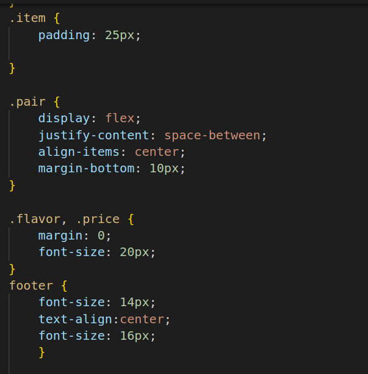

# Cafe-Menu
## Project Explanation

1.
* This link element is used to link an external stylesheet (style.css) to the HTML document. It provides styling information for the content.
* A div element is a generic container for grouping and styling content. It has the class "main" applied, likely for styling purposes or as a way to target specific styles using CSS.
* The h1 element represents a top-level heading. It contains the text "CAMPER CAFE" and has the class "heading" applied, presumably for styling.
* The p element represents a paragraph. It contains the text "Est. 2020" and has the class "established" applied.
* The hr element represents a thematic break or a division between content.
* img element used to display an image. It has a src attribute pointing to an image URL.
* h2 is another heading .

2.
3.

* An article element, which represents a self-contained composition. It has the class "item" applied.
* p is used for paragraph.

4.
* The footer element represents the footer of a document or section.
* A paragraph containing a link to a website. The target="_blank" attribute makes the link open in a new tab or window.

5.
* background-image: Sets the background image of the body element.
* background-size: cover: Ensures the background image covers the entire background area without distortion.
* height: Sets the height of the main container.
* width: Sets the width of the main container.
* background-color: Sets the background color of the main container.
* margin: Centers the main container horizontally on the page.
* text-align: center: Centers the text within the element.
* font-family: Impact, serif: Applies the "Impact" font family to the text, with a fallback to a generic serif font.
* font-size: 40px;: Sets the font size of the text.
* position: relative: Establishes the element as relatively positioned.
* top: 20px: Shifts the element 20 pixels down from its original position.
* text-align: center: Centers the text within the element.
font-style: italic: Applies italic style to the text.

6.
* height: Sets the height of the division line.
* background-color: Sets the background color of the division line.
* border-color: Sets the color of the border.
* width: 90%;: Sets the width of the division line.
* display: flex: Turns the element into a flex container.
* flex-direction: column: Aligns flex items vertically as columns.
* align-items: center: Centers items horizontally within the container.
* text-align: center: Centers text within the element.
* max-width: 100%: Ensures the image doesn't exceed the container's width.
* height: auto: Allows the image to maintain its aspect ratio.

7.
* padding: 25px: Adds spacing around the content within the item container.
* display: flex;: Makes the pair a flex container.
* justify-content: space-between: Distributes items evenly, pushing them to the left and right edges.
* align-items: center: Centers items vertically within the pair.
* margin-bottom: 10px: Adds spacing between pairs.
* .flavor, .price: Targets both "flavor" and "price" classes.
* margin: 0: Removes any default margins.
* font-size: 20px: Sets the font size.
* font-size: 14px: Sets the font size for the footer.
* text-align: center: Centers text within the footer.

8.
* .address: Styles for the address element.
* margin-bottom: 5px: Adds spacing below the address.
* a: Styles for anchor (link) elements.
* color: black: Sets the color of unvisited links.
* a:visited: Styles for visited links.
* a:hover: Styles for links on hover.
* a:active: Styles for links when clicked.

